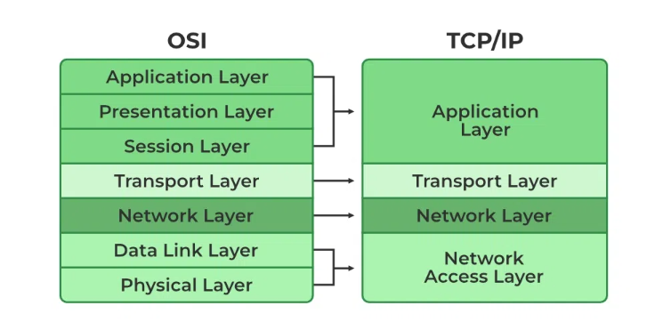

# How TCP/IP work

## 1. Background

### TCP/IP model

TCP/IP model is a framwork for computer network, and the core protocol of the internet. It employs 

TCP/IP consists of four layers: Application layer, Transport layer, Internet layer, and Link layer. And TCP is in 

## 2. practice of sending message to LiDAR_LOC

### CoLa2 

CoLa2(Command Language 2) is an protocol from SICK, but actually, it use TCP/IP to communicate with LiDAR_LOC, nothing special.

Following the steps below.

* 1. 

## Reference

1. GeeksForGeeks-TCP/IP model
https://www.geeksforgeeks.org/tcp-ip-model/

2. GeeksForGeeks-TCP/IP in computer networking
https://www.geeksforgeeks.org/tcp-ip-in-computer-networking/